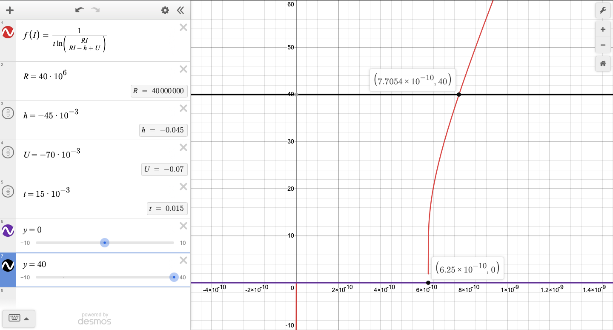

# Assignment 1
Figure 1 shows the $f$-$I$ curve for the given parameters
$$\begin{split}
U_\text{rest} &= -70 \text{mV}, \\
\theta &= -45 \text{mV}, \\
\tau &= 15 \text{ms}, \\
R &= 40 \cdot 10^6 \Omega.
\end{split}$$

$f(I)$ represents the value of the frequency at the current $I$, while $g(F)$ is the inverse of this: it represents the current required to achieve the frequency $F$.

Using this function $g$, we can obtain the range of $I$ required. We can see that for
$$f \in [0, 40] \text{ Hz}$$
to hold, we must have
$$I \in [6.3 \cdot 10^{-7}, 1.5739 \cdot 10^{-4}] \text{ A}.$$

This is the required range.

