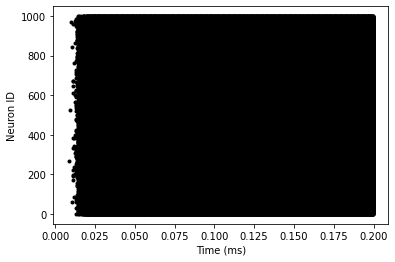
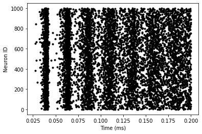
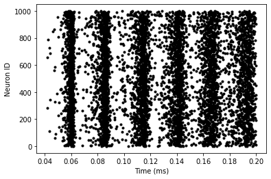
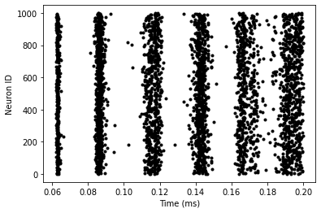

The Colab notebook containing the code can be found [**here**](https://colab.research.google.com/drive/1yeZQqXr9BOW5AjKtEB2TvuWJMcjjOUJc?usp=sharing).

# Exercises
## Neuron Activity
### Background Rate
The background rate has a great impact on neuron activity. For background rates $\leq 20$ Hz, the neurons go almost completely silent (it is nondeterministic as the connections are randomly sampled).

### Connection Strength & Inhibition Gain
The neuronal activity is extremely sensitive to the connection strength $J$. We have seen that with background rate 20 Hz and $J = 0.1$ mV, there is almost no activity; setting $J = 0.2$ mV causes an explosion in activity (Figure 1).

In contrast, the inhibition gain $g$ has next to no effect. Even reducing it from 0.7 to (the value under which the above observations were made) to $10^{-4}$ makes no visible difference.

## Oscillatory Behaviour
The default values of $J$ ($0.1$ mV) and $g$ ($0.7$) cause the group of neurons to fire roughly simultaneously in an oscillatory manner; frequency depends directly on the background rate. This effect is clearest in the range $30 \leq f \leq 60$ Hz (see figures).

## Two Populations
We can create two populations in exactly the same manner as the single population created earlier; the synapses leading out of excitatory neurons (regardless of the postsynaptic neuron) use the event `v_post += J`, while those leading out of inhibitory neurons use the event `v_post -= g*J`.

