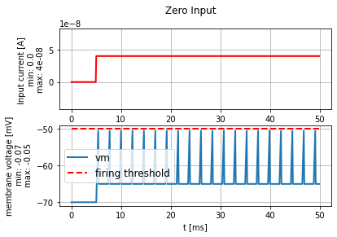
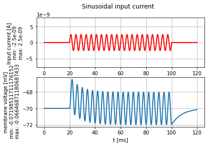
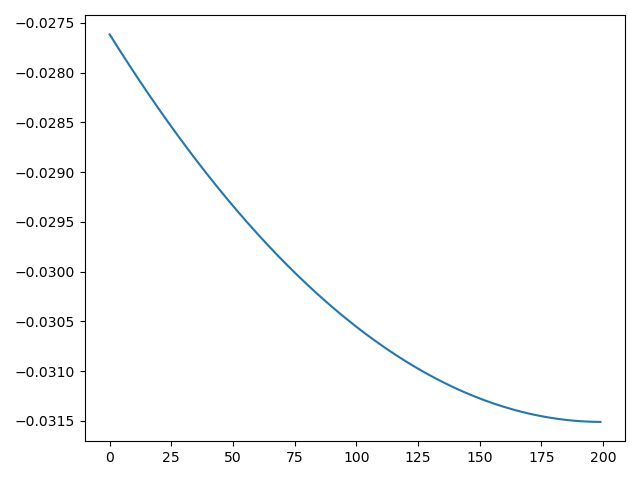

# LIF
## Minimal Current
### $I_\text{min}$ Calculation
Importing `LIF` from `neurodynex3.leaky_integrate_and_fire`, we run `LIF.print_default_values()` and obtain:

```py
Resting potential: -0.07
Reset voltage: -0.065
Firing threshold: -0.05
Membrane resistance: 10000000.0
Membrane time-scale: 0.008
Absolute refractory period: 0.002
```

We know that the voltage asymptotically approaches $U_\text{rest} + RI_0$. Thus, we have
$$U_\text{threshold} = U_\text{rest} + RI_\text{min}$$
which we can rearrange to get
$$I_\text{min} = \frac{U_\text{threshold} - U_\text{rest}}{R}.$$

We can substitute the values above to get
$$\begin{split}
I_\text{min} &= \frac{(-0.05) - (-0.07)}{10^7} \\
&= 2 \cdot 10^{-9} \text{ A} = 2 \text{ nA}.
\end{split}$$

### Simulation
We can simulate and plot the data using the `LIF` class and the `plot_tools` function. The graph obtained can be seen in Figure 1.


The figure shows that our calculation of $I_\text{min}$ is accurate, as the voltage approaches the threshold without causing a spike.

## $f$-$I$ Curve
### Expected Curve
We have calculated that the frequency depends on time as

$$f = \frac1T = \frac1{\tau \ln \left[\frac{RI}{RI - \theta + U_\text{rest}} \right]}$$

according to the LIF model. This has the form of the graph shown in Figure 2.


### Maximum Frequency
The maximum frequency a neuron can fire at is determined by its absolute refractory period (as it cannot fire before the refractory period is over). Thus the smallest time period is $3$ ms (given in the question), which gives us a maximum frequency of approximately $333$ Hz.

### Simulation
We will simulate the neuron for values of current at intervals of $20$ nA from $0$ nA to $100$ nA (inclusive). We restrict the simulation time to $50$ ms (instead of $500$ ms as given in the question) to be able to estimate the firing frequency. The findings are as follows (Figures 3-8 have the graphs).

* $I = 0$ nA
    * estimated frequency: N/A
* $I = 20$ nA
    * estimated frequency: $370$ Hz
* $I = 40$ nA
    * estimated frequency: $400$ Hz
* $I = 60$ nA
    * estimated frequency: $480$ Hz
* $I = 80$ nA
    * estimated frequency: $480$ Hz
* $I = 100$ nA
    * estimated frequency: $480$ Hz





We can plot the $f$-$I$ plot for these values (Figure 3). However, the values for higher currents may not be representative.


## Experimental Estimation
Figure 4 shows the plot of a step current $I = 10$ nA under random parameters.


This graph tells us the following:

* The rest voltage is approximately $-72$ mV.
* The threshold voltage is approximately $-20$ mV.
* The reset voltage is approximately $-82$ mV.
* The absolute refractory period is approximately $2.4$ ms.
* The voltage is approximately approaching the threshold at the spike, in this case. That suggests that $I$ is close to $I_\text{min}$, and therefore $RI$ is close to $U_\text{threshold}- U_\text{rest} \approx 50$ mV. Thus we have $R \approx 5 \cdot 10^6$ $\Omega$.
* When $t=\tau$, the voltage has increased by about 63%. Since $\Delta V \approx 50$ mV, this is about $32$ mV; thus the voltage should be $-72+32 = -40$ mV at $t = \tau$. Inspecting the graph gives us $\tau \approx 8$ ms (since the current started at $t=5$ ms).

We can compare these values with the true values:
```py
Resting potential: -0.07200000000000001
Reset voltage: -0.082
Firing threshold: -0.023
Membrane resistance: 5000000.0
Membrane time-scale: 0.009000000000000001
Absolute refractory period: 0.002
```

Our estimates are fairly accurate.

## Sinusoidal Input Current
### Estimate Phase and Amplitude
Figure 5 shows the plot of membrane voltage under sinusoidal input current with amplitude $2.5$ nA and frequency $250$ Hz.



We estimate the following

* Voltage amplitude = $4$ mV
* Voltage frequency = $125$ Hz
* Phase shift in voltage $\approx 1$ ms

### Plot Voltage Amplitude
Figure 6 shows the correlation between voltage amplitude and input current frequency. We can see that the former decreases exponentially with an increase in the latter.


### Plot Voltage Phase Shift
Figure 7 shows the correlation between voltage phase shift and input current frequency. We can see that the former decreases exponentially with an increase in the latter.


### Filter Type
The LIF model corresponds to a low-pass filter. We can conclude this by observing that input frequencies at or above $5000$ Hz cause a garbled (chaotic and non-sinusoidal) output; thus the model attenuates currents at frequencies above this value.

# Passive Cable Equation
## Evolution of Pulse Input
### Maximum Depolarisation
We create a test current and model its effect on a neuron:
```py
test_current = input_factory.get_step_current(
    t_start=1000, t_end=1100, unit_time=b2.us, amplitude= 0.8 * b2.namp)
voltage_monitor, cable_model = passive_cable.simulate_passive_cable(
                                current_injection_location=[200*b2.umetre],
                                input_current=test_current,
                                length=800 * b2.umetre)
```

Then we run `np.argmax()` and `np.unravel_index` on `voltage_monitor[0].monitor.v` to get the index of the maximum voltage in the array. This yields `(50, 111)`, which we find has the voltage value $-61.63055074$ mV.

### Temporal Evolution
Figure 8 shows the dependence of voltage on time at the various locations from $0$ to $600$ $\mu$m.


### Spatial Evolution
Figure 9 shows the dependence of voltage on distance at the various times from $1$ to $1.6$ ms.


### Discussion
The temporal evolution of the voltage is as expected. At all regions, the voltage peaks at or just after $1$ ms. This peak is highest and closest to $1$ ms at $200$ $\mu$m, which is the site of injection of current. The other peaks are further away from $1$ ms and lower down according to how far away they are from $200$ $\mu$m.

Similarly, the spatial evolution shows how the current is maximum at the point of injection (corresponding to index 125 on the $x$-axis), and sharply drops to the left and gradually to the right. The peak is highest at the time of injection, $1$ ms, and falls as time passes.

## Spatio-Temporal Input Pattern
### Temporal Evolution at Soma
The evolution of the voltage at the soma is shown in Figure 10. The maximum depolarisation is achieved at $-63.1505206$ mV.


### Temporal Evolution at Soma with Reversed Spikes
The evolution of the voltage at the soma is shown in Figure 11. The maximum depolarisation is achieved at $-58.59429012$ mV.


This result makes sense. In the first case, all peaks were at roughly the same height. The spike from $100$ $\mu$m away reached the soma first, with the highest intensity; before it could fall, it was augmented by the less intense spike from $200$ $\mu$m away, and so on.  
In the second case, the spike from $300$ $\mu$m away reached the soma first, and brought it up to a peak; this was immediately augmented by a *more* intense spike from $200$ $\mu$m away, and then by one from $100$ $\mu$m away. This explains the shape of the graphs.

## Effect of Cable Parameters
Figure 12 shows the two graphs obtained with the two parameter sets.


Clearly, the graphs are nearly identical. This shows that the fibre has very little effect on the voltage.

## Stationary Solution
We can see the membrane potential at the beginning and end of the dendrite. The different curves are shown in Figure 13.


We can see the membrane potential as a function of distance in Figure 14.



# Hodgkin-Huxley
## Step Current Response
### Minimal Current for Single Spike
By repeatedly trying out different values, we find that the minimum current $I_\text{min}$ that causes a spike in the HH model is approximately 3 $\mu$A. Below this value, the spike becomes more and more blunt, eventually fading into the stable value around 10 nA.

### Minimal Current for Repetitive Firing
The lowest current value that causes repetitive firing is approximately 6.5 $\mu$A. Below this, there is a region where the neuron fires twice and stops (around 6 $\mu$A), and below this, we have the single-spike region.

## Slow and Fast Ramp Current
### Maximal Slow Ramp Duration
We observe that the maximum ramp duration under which the neuron spikes is approximately 48 ms; at 50 ms, the neuron *does not* spike. The voltage at the end of the ramp is -5.3 mV in the former case and 8.7 mV in the latter.

### Minimal Fast Ramp Duration
The minimum ramp duration for spiking is approximately 90 ms. At the end of the ramp, the voltage is 6.5 mV.

### Differences
The graphs for both the cases described above are shown here.


We see that if the ramp current is slow, the number of spikes increases as the duration decreases, but for fast ramp currents, spiking stops again below a certain duration.

When the current ramps up quickly, it is mainly controlled by $m$, which operates at a small timescale. Thus, if the duration is too small, $m$ does not spike and therefore the voltage remains controlled. As the timescale increases, $n$ and $h$ (which operate at larger timescales) have a greater effect on the voltage (since $m$ achieves its equilibrium value quickly and settles there). However, if the ramp current lasts for a long time, $h \to 0$, which stops the spike.

## Rebound Spike
The following figures show the behaviour of the neuron on the two hyperpolarising currents.


A rough qualitative explanation for this is that when the current stays at a low value for an extended period, the neuron becomes "acclimatised" to this state, and therefore spikes when the current jumps back up to zero. Quantitatively, the voltage remains small at negative values of the current due to $m$ and $n$, which approach 0 at low voltages. The rebound spike could be caused by the high value of $h$ at these voltages (once $m$ is raised).

## Brian2 Implementation of an HH Neuron
We change the line
```py
gNa = 120 * b2.msiemens
```
to
```py
gNa = 120 * 1.4 * b2.msiemens
```
in the source code.

Now, by trial and error, we find that the minimal step current that causes a spike is 1.1 $\mu$A. This is much lower than the previous value of 6.5 $\mu$V; this is because the increased density of sodium channels (modelled as a higher conductance) causes the voltage to be much more sensitive to changes in the input.

Under zero input, the voltage settles at approximately 0.5 mV (Figure 15). This is much higher than the normal voltage.  
This observation ties in with the prediction of the Goldman-Hodgkin-Katz equation, as the selectivity of sodium has increased, which leads to a higher equilibrium voltage.


If the sodium conductance is high enough, the concentration difference of the sodium ions itself creates enough potential difference to exceed the threshold and cause a spike. As this concentration difference is maintained by the sodium pumps and therefore stays constant, the spiking occurs repeatedly.