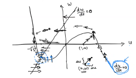

# Hodgkin-Huxley Revisited (contd.)
We have seen how the Hodgkin-Huxley system can be reduced to two degrees of freedom by separating timescales and exploiting similarities. This simplified model is called the FitzHugh-Nagumo model, described by two equations:
$$\begin{split}
C\frac{dU}{dt} = &-g_\text{Na}m_0(u)^3(1-w(t))(U - E_\text{Na}) \\
&- g_\text{K}\left(\frac{w}{a}\right)^4(U - E_\text{K}) \\
&- g_l(U - U_l) + I(t) \\
\frac{dw}{dt} = &- \frac{w - w_0(u)}{\tau_\text{eff}}
\end{split}$$

# Phase-Plane Analysis
The fact that this model is two-dimensional allows us to carry out phase-plane analysis. We can reformulate the FHN model more generally as
$$\begin{split}
\tau \frac{du}{dt} &= F(u,w) + RI(t) \\
\tau_w \frac{dw}{dt} &= G(u,w)
\end{split}$$
and obtain the $u$- and $w$-nullclines. The intersections of these curves are *fixpoints* of the system (the derivaties of both dynamic variables vanish).

Consider the case where
$$\begin{split}
F(u,w) &= u - \frac13 u^3 - w \\
G(u,w) &= b_0 + b_1u - w
\end{split}$$

Here, there is a fixpoint in the third quadrant. We can analyse the flow of the system on the nullclines.  
Along the $u$-nullcline, since $\frac{du}{dt} = 0$, only $w$ changes: thus the system moves up or down only. Similarly, along the $w$-nullcline, since $\frac{dw}{dt} = 0$, only $u$ changes, so the system only moves left or right.
This creates a kind of spiralling effect around the fixpoint.

In general, this system flows to the right under the $u$-nullcline, and to the left above it. Similarly, it flows up to the right of the $w$-nullcline, and down to its left. A combination of these factors determines the movement of the system in an arbitrary region between the nullclines (in this case, the system moves anticlockwise around the fixpoint).

A fixpoint may be *stable* (the above example) or unstable – the system may tend to move away from it.

## Analysis of 2D Neuron Model
We have seen the behaviour of the FHN model under zero input; we will now consider the effect of pulse and step inputs on it.

Under pulse input, $u$ jumps due to the charge deposited by $I(t)$. If the system starts at the fixpoint, it suddenly jumps to some point in the fourth quadrant (increased voltage). From this point, $I(t) = 0$ again, and the system moves around, spiralling back into the fixpoint. This can be seen to correspond to the behaviour of $u$ predicted by other models and observed in experiments.

Under a constant (step) input, the nullclines are shifted (due to the addition of the constant $RI_0$). Now the fixpoint is in the first quadrant. This may also (in the general case) affect the stability of the fixpoint – in this case, it makes the fixpoint an unstable one. The system continuously circles around this fixpoint after the initial jump, which simulates the repetitive spiking observed. The Poincare-Bendixson theorem states that such a limit cycle must exist in 2-dimensional equations.

Thus, the FHN model accurately captures the experimentally observed behaviour of the neuron.