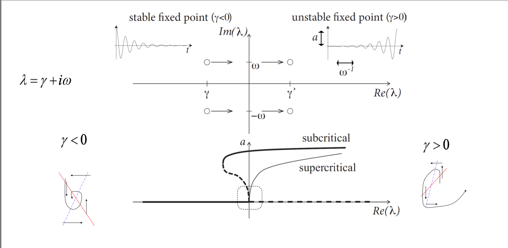

# Phase-Plane Analysis
## Stability of Fixpoints (detour)
Consider the difference between the respective fixpoints in the cases of zero input and constant input. We have seen that the $u$-nullcline rises due to the addition of the $RI_0$ term, which makes the fixpoint rise along the $w$-nullcline – we wish to know how this affects its stability.

We know that the original fixpoint is stable (Figure 1 in [**previous class notes**](./26Sep.md)). In the neighbourhood of this point, we observe anticlockwise inward spiralling behaviour.

After translation, the fixpoint is now at a different place along the curve. It so happens that the neighbourhood of this point displays *outward* spiralling behaviour – the fixpoint is not stable.

Apart from stable and unstable fixpoints, another type, called *saddle points*, exists. These occur in cases when the $u$-nullcline has derivative greater than the $w$-nullcline – then points along the $u$-nullcline tend to move towards the fixpoint, but those along the $w$-nullcline tend to move away.

**Rule of thumb.** Along the $w$-nullcline, left of the fixpoint goes down and right of the fixpoint goes up. Along the $u$-nullcline, above the fixpoint goes left and below the fixpoint goes right.

Consider a general system
$$\begin{split}
\tau \frac{du}{dt} &= F(u,w) + RI_0 \\
\tau_w \frac{dw}{dt} &= G(u,w)
\end{split}$$
with a fixpoint at $(u_0, w_0)$. This point can be obtained by simultaneously solving $F(u,w) + RI_0 = G(u,w) = 0$.  
To find the stability of this fixpoint, consider $u$ in the neighbourhood of $u_0$ and $w$ in the neighbourhood of $w_0$. We define
$$\begin{split}
x &= u - u_0 \\
y &= w - w_0
\end{split}$$
to be the small perturbations from the fixpoint. Now,
$$\begin{split}
\frac{dx}{dt} &= \frac{d(u-u_0)}{dt} = \frac{du}{dt} \\
\tau \frac{du}{dt} &= F(u_0+x, w_0+y) + RI_0 \\
&= F(u_0, w_0) + RI_0 + \frac{\partial F}{\partial u} \bigg\vert_{(u_0,w_0)} \cdot x + \frac{\partial F}{\partial w} \bigg\vert_{(u_0,w_0)} \cdot y \text{ [by truncation of Taylor series]} \\
&= F_u \cdot x + F_w \cdot y
\end{split}$$

A similar line of reasoning holds in the case of $\frac{dy}{dt}$. We can express this set of equations more concisely using vector calculus:
$$\begin{split}
\overrightarrow{x} = \begin{pmatrix} x \\ y \end{pmatrix} \\
\frac{d\overrightarrow{x}}{dt} &= \begin{pmatrix} F_u & F_w \\ G_u & G_w \end{pmatrix} \cdot \overrightarrow{x}
\end{split}$$
The solution for this linear DE is exponential in the eigenvalues of the Jacobian matrix (the coefficient of $\overrightarrow{x}$). Let $\lambda_i = \gamma_i + i \omega_i$ be eigenvalues of the matrix; then we can determine the behaviour of the fixpoint from the sign of $\gamma_i$. The real parts of the eigenvalues represent attraction along each nullcline – thus if both are positive, we have an unstable fixpoint; if both are negative, we have a stable fixpoint; if they have opposite sign, we have a saddle point.

We know that
$$\begin{split}
\lambda_+ + \lambda_- &= F_u + G_w \\
\lambda_+ \lambda_- &= F_u G_w - F_w G_u
\end{split}$$
Thus for a fixpoint to be stable, we conclude that the trace of the Jacobian must be negative, and its determinant must be positive.

## Bifurcation
We have seen that Type II neurons have a discontinuous $f$-$I$ gain function, where there is no repetitive firing below a certain point, and frequency starts at a nonzero value at this point.

I don't understand this part but here's the slide.

