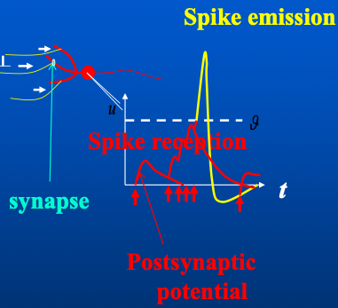
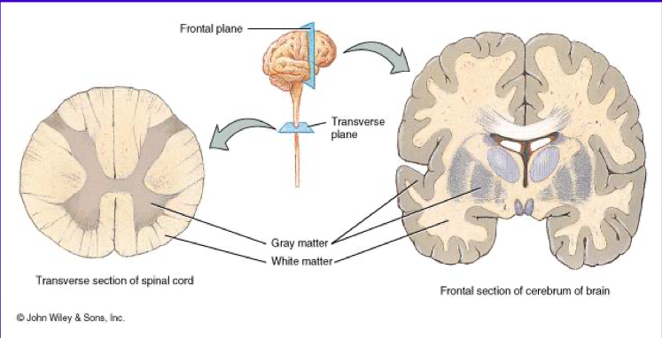
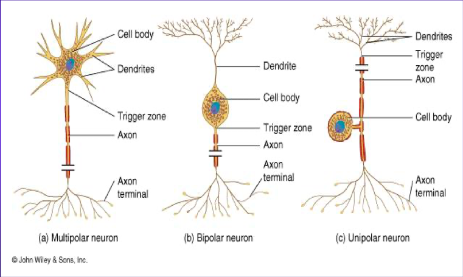
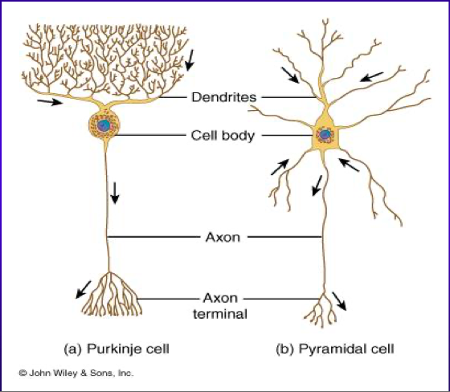
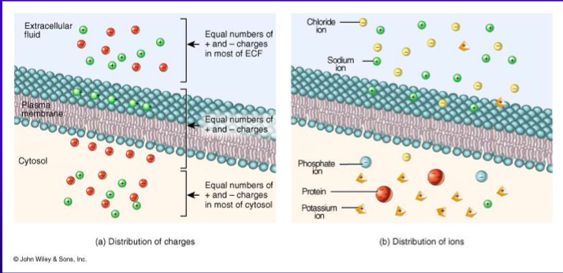
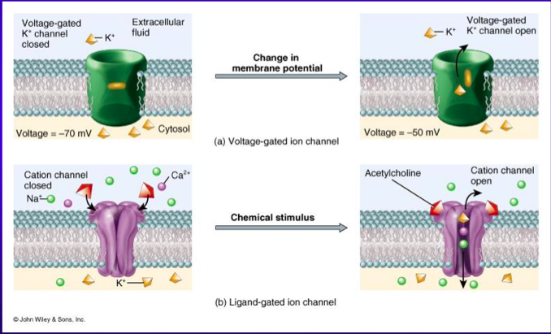
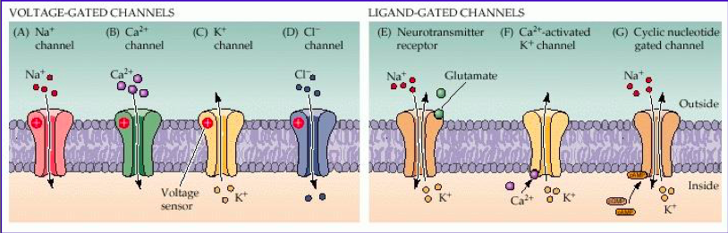

# Introduction to Neuroscience (contd.)
The signals coming from all the dendrites are aggregated in the soma, forming the signal to be sent on to the next cell. This signal is then transmitted down the axon and into a dendrite of the next neuron.  
When a neuron fires, the voltage spikes sharply, undershoots, and then stabilises, in a time frame of 4-5 ms.

## Neurons and Synapses
When a spike in action potential occurs in a dendrite (spike *reception*), the potential of the soma rises sharply and then decays gradually. Multiple such peaks and slopes may overlap. These fluctuations are called *post-synaptic fluctuations*.

When the potential reaches a certain threshold $\theta$ (called *action potential*), it triggers the *emission* of a spike through the axon.

The period in which the potential is rising from the undershoot is called the *refractory period*.

This is called the *integrate-and-fire* model. It is a *phenomenological* model; it describes the process, without going into the details (transmission of voltages, various types of channels, etc.).

## The Brain
The brain is a predictive, or anticipating memory system. It learns to represent the world to generate expectations, and therefore drive goal-directed behaviour.

# Introduction to the Nervous System and Nerve Tissue
## Functions
The nervous system has three basic functions: sensory, integrative, and motor.

* Sensory receptors detect both internal and external stimuli. Their functional units are sensory or *afferent* neurons.
* Sensory input must be integrated and decisions regarding the responses must be taken. The integrative functional units are interneurons (or association neurons), in the brain and spinal cord.
* The responses to integration decisions need to be carried out as well. The motor functional units are motor or *efferent* neurons.

## Organisation of the CNS

The frontal section of the brain shows a demarcation into the left and right hemispheres. Further, the cortical area (which stains grey due to the predominance of somata) is called *grey matter*, while the inner region (which stains white due to the predominance of axons) is called *white matter*. Some of the connections formed by the white matter are inter-hemispherical, while some are intra-hemispherical.  
The pockets between the hemispheres are filled by CSF (cerebro-spinal fluid).

The transverse section of the spinal cord shows the opposite arrangement – grey matter towards the inside and white matter towards the outside.

## Types of Neurons

## Physiology
The intracellular and extracellular fluids (ICF, or cytosol, and ECF) are separated by a flexible boundary formed by fat molecules (whose hydrophilic heads face both ways outside and whose hydrophobic tails are joined together in the middle), which is called a *bilipid* layer.

The bilipid membrane contains a number of channels of different types. *Voltage-gated* ion channels allow ions to cross the membrane once the voltage reaches a certain level. On the other hand, *ligand-gated* ion channels allow ions to pass in the presence of certain other molecules.

