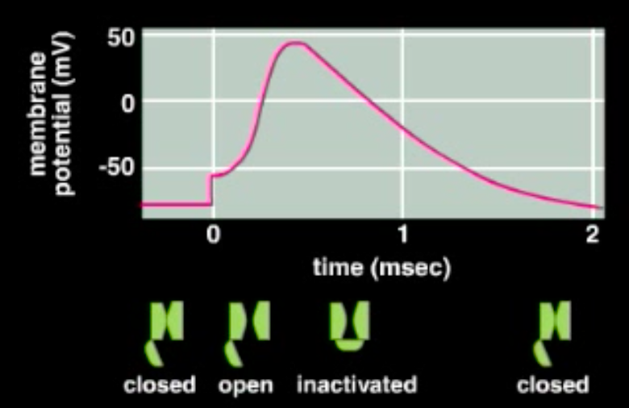

[**Part 1 recording**](https://courses.iiit.ac.in/mod/resource/view.php?id=36318)
[**Part 2 recording**](https://courses.iiit.ac.in/mod/resource/view.php?id=36320)

# Action Potential
Neurons transfer signals from the synapse to synapse through *action potentials*, which must go through the entire axon without weakening. This is achieved by a series of *voltage-gated* channels present along the length of the axon, which undergo a series of changes to transmit the potential.

Consider a sodium channel on the axon. When there is no signal, the channel remains in its closed state, and the membrane potential remains constant in its resting value, about $-80$ mV.  
The application of the action potential (the *stimulus*) causes the membrane to *depolarise* (its voltage rises), and consequently the channel opens, pushing the voltage to a *threshold potential*, around $-50$ mV. Crossing this threshold leads to the channels in the vicinity also opening, kicking off the *depolarising phase*.  
This quickens the increase in the potential of the membrane, causing the potential to rapidly reach sodium's equilibrium potential, about 30-40 mV. At this point, the channel changes into its *inactivated* state.  
Now, the channel cannot open again (which prevents the potential from propagating backwards), and the membrane slowly *repolarises* back to a negative value below its resting value (undershooting, or *hyperpolarisation*, during which the channel closes). It then gradually rises back up (the *after-hyperpolarisation* phase).

During the repolarisation and after-hyperpolarisation, the potassium channels remain open. They close together with the sodium channels after this phase.

This process occurs in the time frame of 3 milliseconds, with each phase lasting about 1 ms. The period between the opening and the closing of the channel is called the *absolute refractory period*, and the period between signals is called the *relative refractory period*.

# Passive Membrane Model
The passive membrane model is a mathematical analysis of the current in the neuron's functioning. It uses this to derive a differential equation to model the voltages in the cell. It proceeds as follows.

By conservation of current, we have that $I(t) = I_R(t) + I_C(t)$. Now, we can calculate
$$\begin{split}
C &= \frac{Q}{U} \\
\implies C \cdot U &= Q \\
\implies C \frac{dU}{dt} &= \frac{dQ}{dt} = I_C(t),
\end{split}$$
and
$$\begin{split}
U_R &= R \cdot I_R \\
U - U_\text{rest} &= R \cdot I_R.
\end{split}$$

Therefore,
$$\begin{split}
I(t) &= I_R(t) + I_C(t) \\
&= \frac1R (U - U_\text{rest}) + C \frac{dU}{dt} \\
\implies RC \frac{dU}{dt} &= - (U - U_\text{rest}) + RI(t)
\end{split}$$

Letting $V = U - U_\text{rest}$ and $\tau = RC$,
$$\tau \frac{dV}{dt} = -V + RI(t).$$

This is the passive membrane model linear DE.