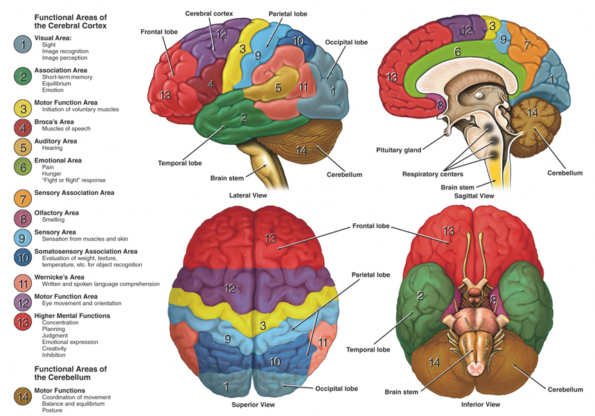

# Action Potential (contd.)
## Transmission
The repolarising phase is called the relative refractory period as this is the period during which the next impulse *can* be started, causing a new depolarising phase. In contrast, during the absolute refractory period, no new signal can be conducted. This is because the potassium channels are closed during the latter but open during the former.

There are two mechanisms of transmission, depending on whether or not the neurons have *myelinated* axons. Unmyelinated axons allow the current to flow continuously along the axon (called *continuous conduction*), while myelinated axons restrict the current to *jump* across segments of the sheath, between the nodes of Ranvier (called *saltatory conduction*).

## Synapses
At synapses, two kinds of aggregation (or summation) take place – *spatial* and *temporal*. Spatial aggregation refers to the combination of signals arriving from multiple presynaptic neurons (simultaneously), while temporal aggregation refers to a single presynaptic neuron firing multiple times.

## Brain Waves
Brain waves have a certain frequency, and different kinds of brain waves are associated with different regions in the brain and different states of mind. For example,

* *alpha waves* have frequencies in the 8-13 Hz range, arise from the parieto-occipital region, and are observed in a wakeful, resting person.
* *beta waves* have frequencies in the 14-30 Hz range, arise from the frontal and parietal regions, and are observed in states of mental activity and sensory stimulation.
* *theta waves* have frequencies in the 4-7 Hz range, and are common in children and sleepy adults.
* *delta waves* have frequencies less than 3.5 Hz and high amplitudes, and are observed in infants and deeply sleeping adults.

# Structure of the Brain
The brain has multiple regions (typically named after the bone under which they are located), like the frontal lobe, the motor cortex, etc.

# Passive Membrane Model (contd.)
We have seen the linear differential equation that represents the passive membrane model:
$$\tau \frac{dV}{dt} = -V + RI(t)$$
We can analyse the behaviour of $U_\text{membrane}$ according to this equation under certain conditions.

First, consider the steady state, where voltage does not change, *i.e.*,
$$\frac{dV}{dt} = 0.$$
In this case, we have
$$V = U_\text{membrane} - U_\text{rest} = RI(t).$$
When $I(t) = 0$ (there is no current), then
$$U_\text{membrane} = U_\text{rest}.$$
This is the observed behaviour when there is no input.

When $I(t) = 0$ in general, we can solve the DE to get
$$V(t) = e^{\frac{-t}\tau + c},$$
or
$$V(t) = V_0 e^{\frac{-t}\tau},$$
where $V_0 = e^c$.

This model is called the *passive* membrane model as it does not account for the active flow of ions. Ion gates are not modelled.
