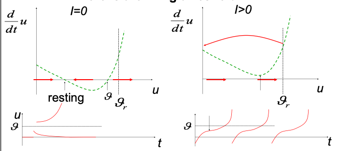

# Leaky Integrate-and-Fire Model (contd.)
## Generalised Integrate-and-Fire Model
We know that the differential equation associated with the LIF model depends linearly on $U_\text{membrane}$. We can generalise it to the *nonlinear integrate-and-fire equation*:
$$\tau \frac{dU_\text{membrane}}{dt} = F(U_\text{membrane}) + RI(t).$$
[the other equation for the LIF model remains the same]

Now we can analyse the solution of this equation under different functions $F$. For example, the quadratic integrate-and-fire model sets
$$F = \lambda u \to c_2(u-c_1)^2 + c_0,$$
and the exponential integrate-and-fire model sets
$$F = \lambda u \to -(u - U_\text{rest}) + c_0 e^{(u - \theta)}.$$
This value $\theta < \theta_r$ is a kind of pseudo-threshold; once the voltage reaches this value, it can only increase and must therefore hit the actual threshold $\theta_r$.

## Quality of LIF Models
We evaluate models based on how well they simulate observed data. Experiments suggest that NLIF models approximate the data very well.

However, they do not give a complete picture; they only serve to describe a single neuron. They need to incorporate noise and be integrated into models that describe dendrites and synapses.

# Biophysics of Neurons
## Resting Potential
We have seen that the cell is surrounded by a bilipid membrane that contains ion channels and ion pumps.

Ion pumps actively maintain differences in concentration between the inside and the outside of the cell. This difference in concentration maintains the difference in potential – this relation can be described through the intermediary variable of energy $E$, as follows.
$$\begin{split}
E &= qU \\
n &\propto e^{-\frac{E}{kT}}. \end{split}$$

Thus we can calculate the potential across the membrane, or *Nernst reversal potential* $\Delta u$, given the concentrations $n_1$ and $n_2$ (inside and outside respectively):
$$\begin{split}
\frac{n_1}{n_2} &= \frac{e^{-\frac{E_1}{kT}}}{e^{-\frac{E_2}{kT}}} = e^{-\frac1{kT}(E_1 - R_2)} \\
&= e^{-\frac{q}{kT}(u_1 - u_2)} \\
\implies \ln\left(\frac{n_1}{n_2}\right) &= -\frac{q}{kT}(u_1 - u_2) \\
\implies \Delta u &= -\frac{kT}{q} \ln \left(\frac{n_1}{n_2}\right).
\end{split}$$

The reversal potential is a characteristic value for *a certain type of ion*. For instance, sodium would have some reversal potential (depending on its concentrations), and potassium would have some different value, and so on.  
The *resting potential* of the membrane is the aggregate (not algebraically; its value is determined by a chemical equlibrium) of all the various resting potentials.