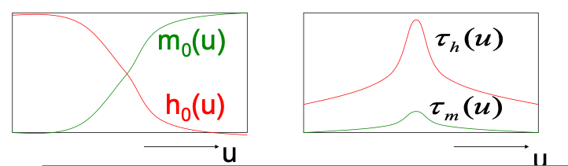
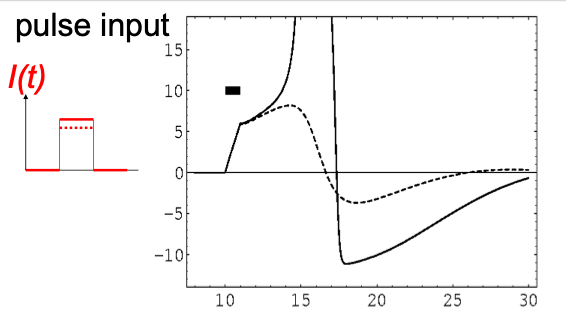
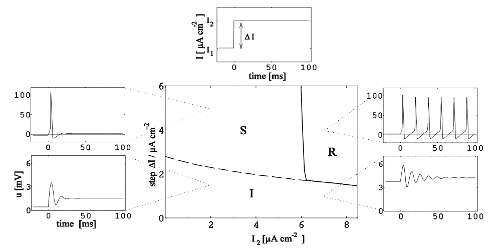

# Hodgkin-Huxley Model (contd.)
## Pulse Input
Suppose a stimulus (in the form of a pulse current) is provided to a neuron in resting state. In this state, $h_0$ is high and $m_0$ is low.

The increased value of $I(t)$ causes the voltage to rises, leading to a rapid increase in $m$. $h$ changes much slower, however; thus it remains relatively high.  
This increases the sodium current and drives the voltage up. This in turn takes $m$ to its steady value, and causes $h$ to drop. As the voltage approaches $U_\text{Na}$, however, the sodium current drops to zero.

This is the point where potassium's gating variable $n$ rises to its peak. This, however, drives current *opposite* to $I(t)$, which means that hyperpolarisation starts here. This continues steeply until $U$ reaches $U_\text{K}$, at which point it begins to rise again towards $U_\text{rest}$.

The thresholding here relies on $U$ reaching a sufficient value for $m$ to push the sodium current up. There is no strict threshold imposed on these equations.

Refractoriness is also simulated by this model; strong stimuli supplied during the period where $U$ rises from $U_r$ to $U_\text{rest}$ cause only a fluctuation but not a spike. It is therefore harder to elicit a second spike.

## Step Input
A step input is determined by two parameters – a current change $\Delta I$ and a final current $I_2$. Depending on the values of these parameters, the step input evokes different behaviours in the HH model; we can divide these behaviours into the R, S and I regions.

In the R region, the neuron fires repeatedly with a fixed frequency. This requires relatively high values for both $\Delta I$ and $I_2$.

In S, the neuron emits a single pulse and then settles down at $U_\text{rest}$. This requires a high value of $\Delta I$ but lower values of $I_2$.

In I, which occurs under low values of $\Delta I$ (regardless of $I_2$), the neuron emits a number of spikes of decreasing amplitude, eventually dropping to zero.

