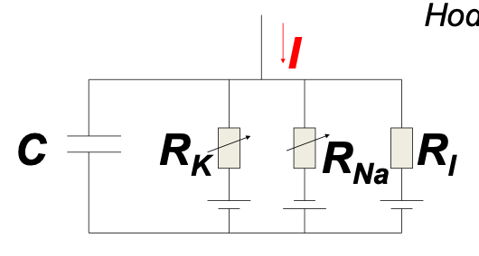

# Hodgkin-Huxley Model
The Hodgkin-Huxley model incorporates the reversal potential of different ions and variable conductance of the neuron membrane. Each ion is a separate branch of a circuit, which contains a battery (representing the reversal potential) and a variable resistor.

The last branch is a catch-all for the unmodelled ions that are part of the environment.

Mathematically, we have that
$$I(t) = I_C + I_\text{K} + I_\text{Na} + I_l,$$
by conservation of charge.  
We also know, for $I_C$, that
$$\begin{split}
CU &= Q \\
\implies C \frac{dU}{dt} &= \frac{dQ}{dt} = I_C
\end{split}$$

We also know that, for each branch,
$$I_R = \frac1R \cdot (U - U_\text{rev}).$$

Substituting and rearranging, we get
$$\begin{split}
C\frac{dU}{dt} &= - I_\text{K} - I_\text{Na} - I_l + I(t) \\
&= - \frac1{R_\text{K}} (U - U_\text{K}) - \frac1{R_\text{Na}} (U - U_\text{Na}) - \frac1{R_l} (U - U_l) + I(t) \\
&= - g_\text{K} \cdot (U - U_\text{K}) - g_\text{Na} \cdot  (U - U_\text{Na}) - g_l \cdot (U - U_l) + I(t)
\end{split}$$

The conductance $g$ of any of the ions, however, varies according to the degree to which the corresponding channels are open, which is modelled by a *gating variable* $\in [0,1]$.  
For potassium, we have a single gating variable $n$, while for sodium we have two, $m$ and $h$. $m$ is the *activation* gating variable, while $h$ is the inactivation gating variable. These are added to the equation above to get
$$C\frac{dU}{dt} = - g_\text{K} \cdot n^4 \cdot (U - U_\text{K}) - g_\text{Na} \cdot m^3 \cdot h \cdot  (U - U_\text{Na}) - g_l \cdot (U - U_l) + I(t).$$

We also have equations to determine the values of the gating variables:
$$\begin{split}
\frac{dn}{dt} &= -\frac{[n- n_0(u)]}{\tau_n(u)} \\
\frac{dm}{dt} &= -\frac{[m- m_0(u)]}{\tau_m(u)} \\
\frac{dh}{dt} &= -\frac{[h- h_0(u)]}{\tau_h(u)}
\end{split}$$
The equilibrium potentials and time constants are functions of the voltage. For example, $n_0$ has the form of the sigmoid, while $\tau_n$ has the form of $\sigma'$.

These four equations together are the Hodgkin-Huxley equations.

The general framework of this model can be expressed in the following equations
$$\begin{split}
C\frac{dU}{dt} &= - \sum I_\text{ion} + I(t) \\
I_\text{ion} &= - g_\text{ion} \cdot r^{n_1} s^{n_2} \cdot (U - U_\text{ion}) \\
\frac{dr}{dt} &= -\frac{[r-r_0(u)]}{\tau_r(u)} \\
\frac{ds}{dt} &= -\frac{[s-s_0(u)]}{\tau_s(u)}
\end{split}$$

The HH differential equations automatically model the firing threshold and the spiking behaviour.