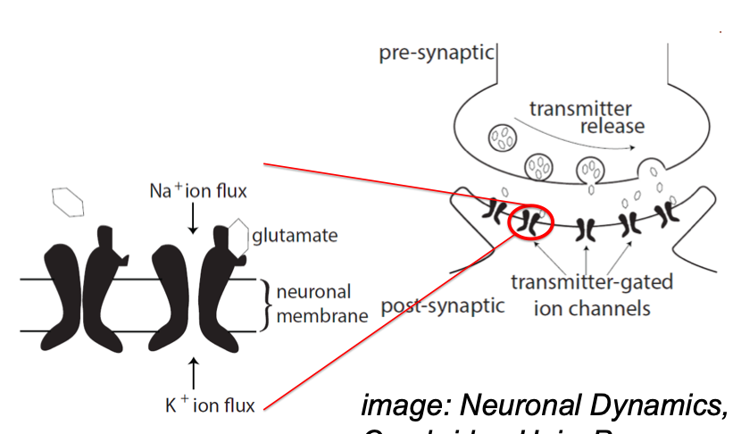
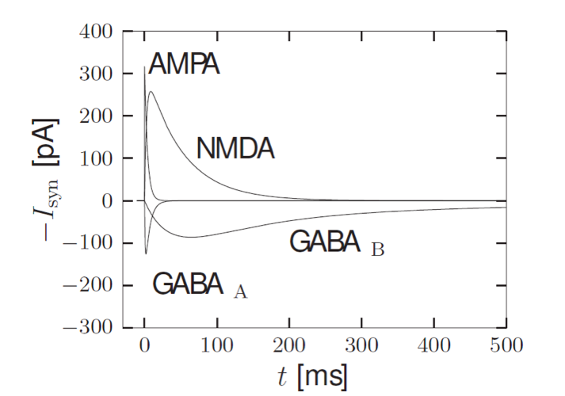
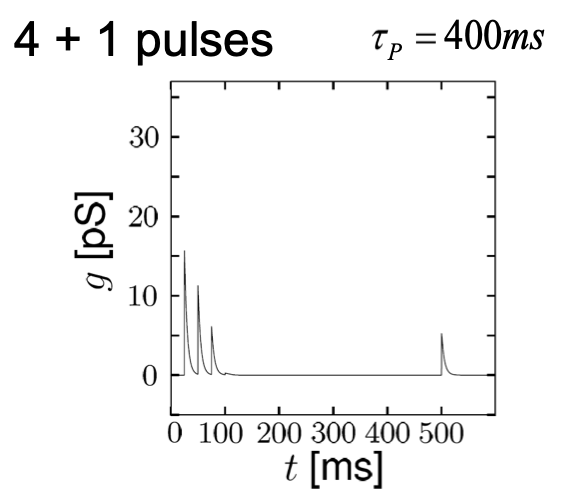
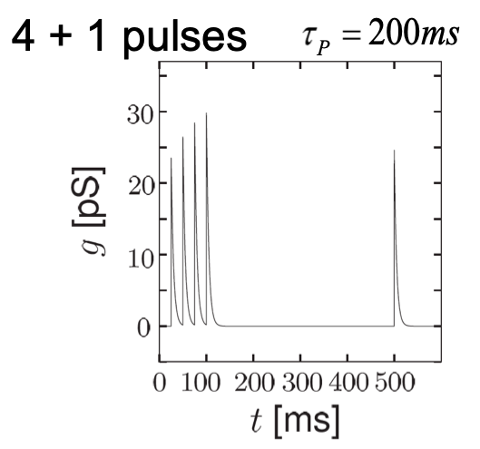

# Synapses
The synapse is the region connecting the axon of one neuron to the dendrites of another. The axon (the pre-synaptic region) releases certain transmitters (*e.g.* glutamate) into the space between the two cells, and the dendrite (the post-synaptic region) has transmitter-gated ion channels, which open to allow sodium ions in and potassium ions out in the presence of the transmitter.

There are two kinds of synapses – *excitatory* and *inhibitory*.  
The main neurotransmitters for excitatory synapses are

* AMPA – it reacts rapidly, and calcium cannot pass.
* NMDA (N-methyl D-aspartate) – it reacts slowly and calcium can pass.

At inhibitory synapses, GABA ($\gamma$-aminobutyric acid) is an important neurotransmitter. There are two types of channels gated by it – $\text{GABA}_\text{A}$ (fast) and $\text{GABA}_\text{B}$ (slow).

## Modelling
We will try to modify the Hodgkin-Huxley model with this information. We add a new term
$$-I_\text{syn}(t) = -g_\text{syn}(t) (u - E_\text{syn}).$$

We need to model $g_\text{syn}(t)$ as well. The decay can be described as
$$g_\text{syn}(t) = \overline{g}_\text{syn} e^{-\frac{(t-t_k)}\tau} \Theta(t-t_k),$$
but this does not account for the rise time; thus we add a factor to model that phase:
$$g_\text{syn}(t) = \overline{g}_\text{syn} e^{-\frac{(t-t_k)}\tau} \left[1 - e^{-\frac{(t-t_k)}{\tau_\text{rise}}} \right] \Theta(t-t_k).$$

[$\Theta$ is a step function whose value is 1 when its argument is greater than 1 and 0 otherwise.]

Thus we have the complete equation
$$\begin{split}
C\frac{dU}{dt} = &- g_\text{K} \cdot n^4 \cdot (U - U_\text{K}) \\
&- g_\text{Na} \cdot m^3 \cdot h \cdot  (U - U_\text{Na}) \\
&- g_l \cdot (U - U_l) + I(t) \\
&- I_\text{syn}(t).\end{split}$$

The $E_\text{syn}$ is approximately 0 mV for excitatory synapses, and $-75$ mV for inhibitory synapses.

## Plasticity
Synapses have short-term plasticity. If the same stimulus is applied repeatedly, the amplitude of the response is higher.

Short-term plasticity is modelled by the variables $P_\text{rel}$ (the fraction of vesicles that are ready to use at the synaptic terminal) and its steady state value $P_0$:
$$\frac{dP_\text{rel}}{dt} = -\frac{P_\text{rel} - P_0}{\tau_P} - f_DP_\text{rel} \sum_k \delta(t-t^k).$$

The $f_D$ factor (which lies between 0 and 1) is part of the *synaptic depression* model; the peaks are become smaller and smaller with successive pulses.

We can model *synaptic facilitation* by a similar equation:
$$\frac{dP_\text{rel}}{dt} = -\frac{P_\text{rel} - P_0}{\tau_P} + f_F(1-P_\text{rel}) \sum_k \delta(t-t^k).$$

We can incorporate this into the above equations by making $\overline{g}_\text{syn}$ depend on it as
$$\overline{g}_\text{syn} = cP_\text{rel}.$$