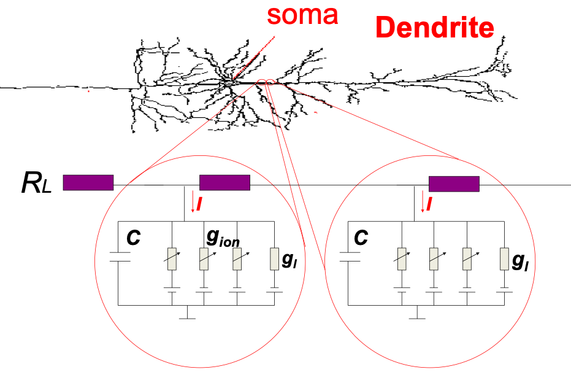
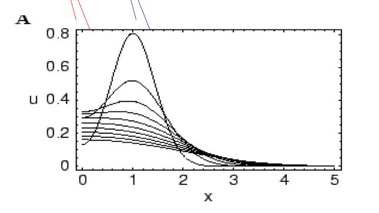
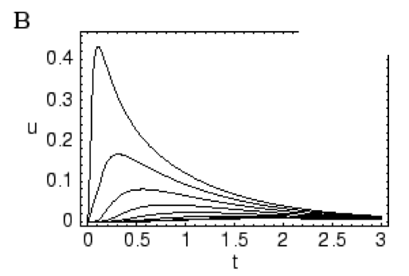
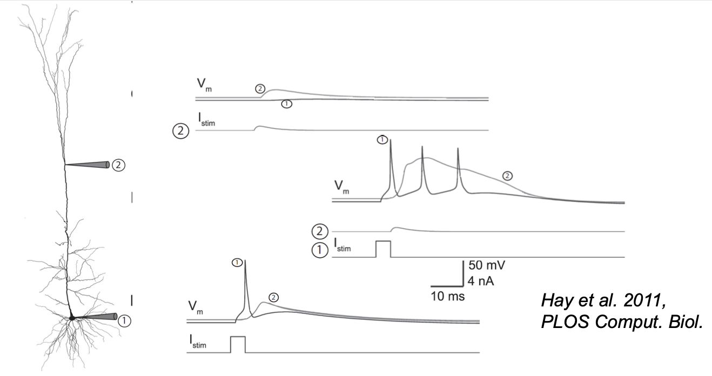

# Dendrites (Compartmental Models)
The dendrites and axon are cable-like extensions from the soma. Dendrites have a tree-like structure in general. We model the dendritic and axonal fibre as longitudinal resistances at sections of the cable, separated by RC circuits (modelling the channels).

The equation that describes this model is as follows
$$\frac{u(t, x - dx) - 2u(t,x) + u(t, x + dx)}{R_L} = C \frac{d}{dt}u(t, x) + \sum_\text{ion} I_\text{ion}(t, x) - I^\text{ext} (t, x).$$
This model is an example of a *compartmental model*, as it models each component of the cell independently.

To derive this, let $x$ be the point along the fibre which receives external current $I_\text{ext}$, and let there be resistances $R_L$ in the ranges $[x-dx, x]$ and $[x, x+dx]$. By Kirchhoff's Current Law, we have
$$I_L(t, x) + I^\text{ext}(t,x) = I(t,x) + I_L(t, x+dx),$$
where $I$ is the outgoing current at point $x$, which splits into currents trhough capacitors and variable resistances for the ions. Mathematically,
$$I(t,x) = I_C(t,x) + \sum_\text{ion} I_\text{ion}(t,x),$$
or
$$I(t,x) = C\frac{d}{dt}u(t,x) + \sum_\text{ion} I_\text{ion}(t,x).$$

We can apply Ohm's law on the resistances $R_L$ and rearrange equation 1 above to
$$I(t,x) = I^\text{ext}(t,x) + \frac{u(t,x-dx) -2u(t,x) + u(t,x+dx)}{R_L}.$$

Equating the last two equations and rearranging gives us the equation.

We can substitute the quantities $R_L$, $C$, $I_\text{ion}$ and $I^\text{ext}$ with their respective differentials over space. Doing this and shifting $dx$ and $r_L$ around gives us
$$\begin{split}
\frac{u(t,x-dx) - 2u(t,x) + u(t,x+dx)}{dx^2} &= cr_L \frac{d}{dt}u(t,x) + r_L \sum_\text{ion} i_\text{ion}(t,x) \\
&- i^\text{ext}(t,x) \\
\frac{d^2}{dx^2}u(t,x) &= cr_L \frac{d}{dt}u(t,x) + r_L \sum_\text{ion} i_\text{ion}(t,x) \\
&- i^\text{ext}(t,x).
\end{split} $$

This is the *cable equation*.

The ionic current term can have three values:

* in passive dendrites, it sums up to the leak current.
* in active dendrites, the `ion` variable ranges over calcium and sodium.
* in axons, the `ion` variable ranges over sodium and potassium.

We can express $i_\text{ion}(t,x)$ by $\frac{u(t,x)}{r_m}$. Substituting this and multiplying by $\frac{r_m}{r_L}$ throughout, we have
$$\frac{r_m}{r_L} \frac{d^2}{dx^2}u(x,t) = cr_m \frac{d}{dt}u(t,x) + u(t,x) - r_mi^\text{ext}(t,x).$$

We identify the constants
$$\begin{split}
\lambda &= \sqrt{\frac{r_m}{r_L}} \\
\tau_m &= cr_m \end{split}$$
and substitute them to get
$$\lambda^2 \frac{d^2}{dx^2}u(x,t) = \tau_m \frac{d}{dt}u(t,x) + u(t,x) - r_mi^\text{ext}(t,x).$$

# Hay et al. (2011)
[4.3 in Chapter 3]

This model is also a compartmental model, with 200 compartments of $\leq 20 \mu m$. It posts two types of sodium current – transient (of the HH type) and persistent (non-inactivating). Similarly, there are two types of calcium currents and three types of phosphorus currents.

